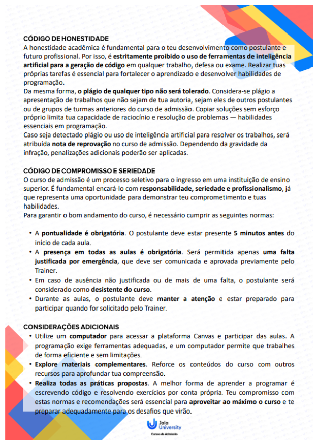

A [Jala University](Jala%20University.md) tem um programa de graduação em Engenharia de Software. Entre os diferenciais do projeto destacam-se a formação com direcionamento internacional e de alta performance, diploma de graduação universitária, curso intensivo em língua inglesa, e a oportunidade de carreira internacional com os investidores do programa ao final do curso.

---

## Etapas

1. Inscrição;
2. Sessão Informativa;
3. Prova de Perfil Social Vocacional (PSV);
4. Teste de atitude e Lógica;
5. [[Jala University - Curso de admissão da Engenharia de Software]]:
	1. Módulo 1 - Introdução à programação
		1. Apresentação do curso de admissão;
		2. Fundamentos da programação;
		3. Programação básica;
		4. Estruturas de controle;
	2. Módulo 1 - Programação Orientada a Objetos (POO)
		1. Classes, objetos, atributos e métodos, abstração
6. Teste diagnóstico de Inglês;
7. Pesquisa de ambiente de Estudo;
8. Entrevista com pais e tutores;
9. Assinatura da Carta de Aceitação;

## Regras do curso de admissão

Fonte: [Jala University](Excalidraw/Jala-Engenharia_software-Curso_admissao-Regras.excalidraw.md)