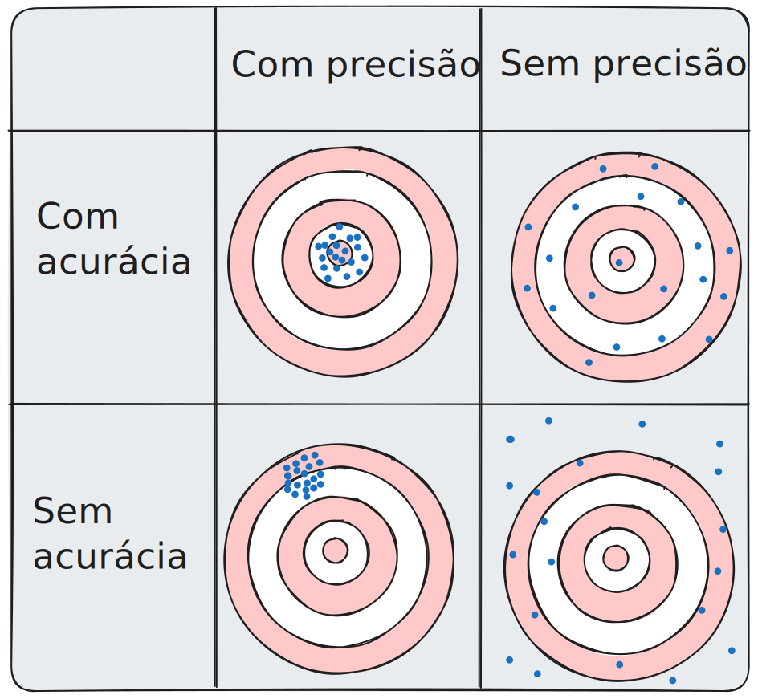

Acurácia é um parâmetro estatístico que indica o quão correto é um dado valor em relação à realidade. É importante destacar que exite muita confusão entre acurácia e [Precisão](Precisão.md): A acurácia se preocupa com quão verdadeiro é um dado, apesar de não necessariamente ser consistente, enquanto que um dado preciso é consistente, apesar de não necessariamente ser verdadeiro.

(Fonte: [Autoria própria](../../../../../excalidraw/2024/07/2024-07-19-precisao_acuracia.excalidraw.md))