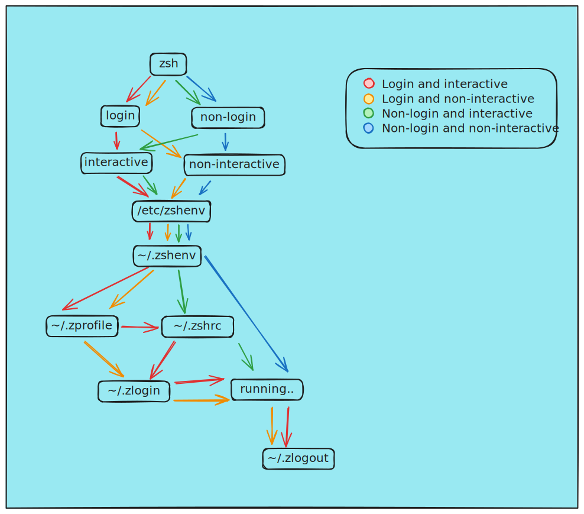

Z shell, comumente chamado como ZSH, é um interpretador de comandos para [sistemas operacionais](../../../../2024/08/04/atomo/Sistema_Operacional.md) [UNIX](UNIX.md)-like.

---

## Configuração
As principais configurações do ZSH estão em um arquivo na [pasta home](../../../../2024/07/14/atomo/Pasta_home.md) nomeado como `.zshrc`. Podemos ver as configurações com o seguinte comando:

```shell
cat ~/.zshrc
```


([autoria própria](../../../../../../Excalidraw/zsh_startup.excalidraw.md))

### Recarregando as configurações
Para recarregar as configurações do ZSH sem a necessidade de reiniciar o [emulador de terminal](../../../../2024/07/26/atomo/Emulador_de_terminal.md), execute o comando abaixo:

```shell
source ~/.zshrc
```