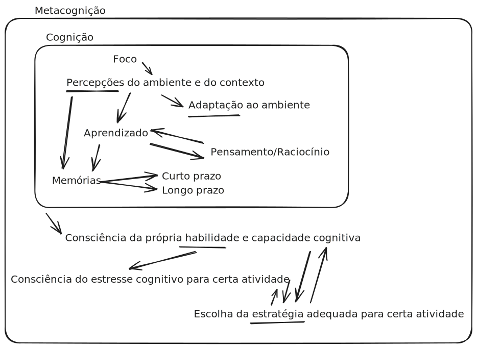
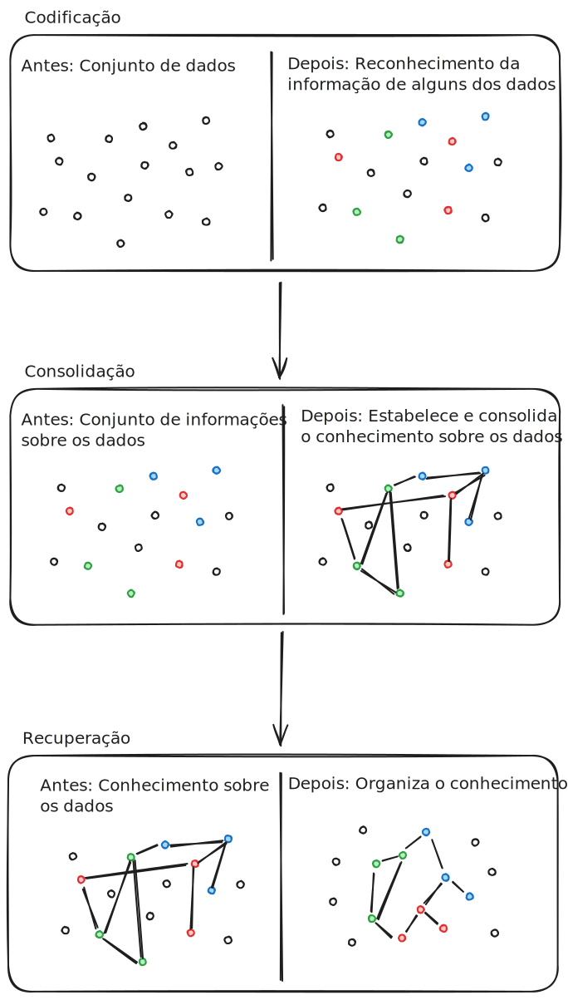
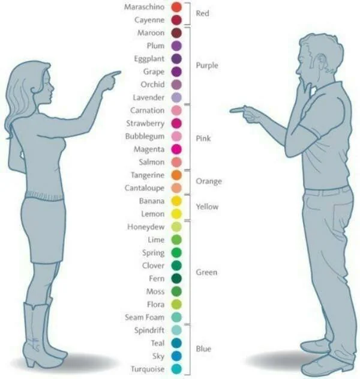

## Dificuldade no aprendizado
Muitas vezes, nosso próprio conhecimento sobre a forma como aprendemos e sobre o aprendizado em geral é ignorado ou temos a percepção equivocada sobre ela. Muitos confundem a dificuldade no avanço do aprendizado com a falta de vocação para aquele assunto ou fazem uso de estratégias de aprendizados ineficientes como o reforço por repetição. No primeiro exemplo, a falta do avanço pode ser motivado tanto por uma crença limitante que bloqueia o aprendizado (ou talvez o [efeito pigmaleão](../atomo/Efeito_pigmaleao.md)) como também pode ser por causa de uma estratégia de aprendizado inadequado para aquela pessoa ou para aquele conteúdo. O segundo exemplo é um erro clássico de confundir a memorização com o aprendizado, visto que a memorização é uma fixação de uma determinada informação na memória mas que não ajuda na aplicação da informação em contextos semelhantes ao que foi memorizado e impedem a adaptação dessa informação.

## Cognição
A [cognição](../../17/atomo/Cognicao.md) é o processo pelo qual os seres percebem e interpretam o mundo, permitindo que eles: 
 - Tenham uma consciência do ambiente e do contexto pela sua **percepção**;
 - Foquem no que é importante ser percebido e ignorem o que não é relevante;
 - Codifiquem as informações adquiridas em memórias (de longo ou curto prazo) que poderão ser recuperados;
 - Aprendam a como interagir e se adaptar com o meio externo;
 - Formulem pensamentos e raciocínios;

## Metacognição
A [metacognição](../../17/atomo/Metacognicao.md) é a habilidade de ter consciência da cognição para refletir ou regular alguns processos cognitivos para obter uma melhor performance. A metacognição também engloba o conhecimento sobre:
 - **Si mesmo**: Quais suas capacidades e limitações cognitivas (por exemplo, "sou bom em lembrar rostos, mas esqueço nomes").
 - **Tarefas**: O grau de exigência de determinados processos cognitivos que uma certa tarefa pode demandar (por exemplo, "Ler um livro de matemática vai exigir mais atenção do que ler um livro de ficção").
 - **Estratégias**: A capacidade de conhecer a forma como um processo cognitivo pode ser executado e assim podendo escolher a estratégia mais adequada para as diferentes situações

(Fonte: [autoria própria](../../../../../../Excalidraw/Cognicao_metacognicao.excalidraw.md))
## Como aprendemos?
A teoria real é mais complexa e envolve mais fatores, mas podemos simplificar na seguinte estrutura que será exemplificado com uma analogia com a formação de uma biblioteca nova. 

### Codificação
Digamos que estou construindo a minha primeira biblioteca particular e alguém me dá um livro sobre conserto de carros. O primeiro passo que vou dar é descobrir o que estou segurando, olhar a contracapa, ler o índice, folear os capítulos capítulos para ver do que trata este livro. **Codificar** significa formar uma impressão de algo. Pegar informações sensoriais e formar uma representação, ou o que é chamado de traço de memória no cérebro. Isso acontece em nossa [memória de curto prazo](content/notas/2024/07/12/atomo/Memoria_de_curto_prazo.md) e acontece o tempo todo. Cada nova experiência que temos, cada nova impressão causada sobre nós cria uma nova marca de memória. E como formamos rastros de memória o tempo todo, nem todos os rastros de memória são preservados. Nem tudo passa da [memória de curto prazo](content/notas/2024/07/12/atomo/Memoria_de_curto_prazo.md) para a de [longo prazo](content/notas/2024/07/08/atomo/Memoria_de_longo_prazo.md).

O que é importante nesta etapa é saber filtrar quais livros (ou conhecimentos) são importantes para guardarmos na nossa biblioteca e quais podemos doar (esquecer) para que não deixemos nossa biblioteca lotada de livros sem utilidade ou relevância. A forma mais fácil de realizar essa filtragem é se perguntar como ela pode ajudar no dia-a-dia ou se ela se encaixa com o que já existe na biblioteca. No nosso exemplo, se a gente dirige carro, term um livro sobre conserto de carros pode ser útil no nosso cotidiano e talvez a gente queira cria uma nova seção na nossa biblioteca para poder guardar esse livro sem que ele fique perdido entre os demais ou podemos avaliar se ela se encaixa em alguma seção que já existe.

### Consolidação
Essa etapa de descobrir onde este livro pertence na minha biblioteca é chamada de consolidação. A consolidação reorganiza e estabiliza os traços da memória, o significado e as conexões com experiências passadas e outros conhecimentos na [memória de longo prazo](content/notas/2024/07/08/atomo/Memoria_de_longo_prazo.md). Nesta etapa é onde organizamos o livro que adquirimos e de certa forma vamos conecta-lo com os outros livros.

É nesta etapa que podemos, por exemplo, lembrar que esse livro de concerto de carro seja útil guardar junto com o atlas da cidade. Nesta etapa, também podemos avaliar se a gente tinha guardado um livro obsoleto e que devemos jogar fora ou avaliar que talvez o álbum de fotos de viagens deveria estar fora dessa seção.

### Recuperação
Por fim, o objetivo final de uma biblioteca é para que possamos ir consultar livros que nos serão útil em um determinado momento no futuro. Para isso, precisamos ser capazes de saber qual informação queremos encontrar e onde que essa informação está. A grande falha na mera memorização é que ela dificulta para a recuperação da informação no momento em que ela é importante, é como se todo novo livro fosse apenas embilhado em uma torre de livro ao acaso. Além disso, a frequência em que a gente revisita cada livro ajuda a facilitar na etapa de recuperação, pois ficamos mais familiarizados em como os livros estão organizados e onde que cada informação está localizada. Da mesma forma, quanto mais regularmente lembrarmos e utilizemos as informações que aprendemos, melhoremos seremos capazes de encontrá-las e aplicá-las no futuro. 

(Fonte: [Autoria própria](../../../../../../Excalidraw/Como_aprendemos.excalidraw.md))

## Ativação do conhecimento prévio
Quando começamos a aprender um assunto novo, temos dificuldade de recuperar esse aprendizado mas, conforme nos aprofundando, com o tempo ficamos melhores em recuperar esse aprendizado. Isso se deve pois no inicio sabemos pouco sobre o assunto e as ideias tem poucas conexões com a nossa memoria prévia. Conforme adquirimos mais conhecimento, obtemos mais dados que se aplicam ao contexto e podemos percorrer pelo nosso conhecimento com mais facilidade pois os conceitos se tornam mais conectados. Por exemplo, no começo a gente conhece algumas poucas cores mas conforme crescemos a gente aprende novas cores e consegue os diferenciar pois temos como comparar com as cores que já conhecemos antes e conseguimos cada vez mais notar pequenas variações das cores.

Percebendo que o conhecimento prévio ajuda no processo de aprendizado, podemos concluir que:
1. O aprendizado gradual e linear é mais efetivo e eficiente do que tentar aprender algo muito diferente do que a gente já conhece;
2. Ser capaz de estabelecer conexões com o nosso conhecimento prévio facilita o aprendizado.

Isso torna evidente de que é importante sermos autoconsciente do nosso próprio conhecimento e termos claros o que queremos aprender. Avaliar o nosso conhecimento também nos permite perceber lacunas de aprendizados que tornaria o processo mais fácil e podemos dar alguns passos pra trás do aprendizado para que o nosso conhecimento seja mais sólido e eficiente para que possamos aplicar ele quando necessário. Além disso, a avaliação também indica quais informações a gente deveria procurar e prestar atenção para preencher as lacunas do nosso conhecimento.

Avaliar o nosso conhecimento também é útil para fortalecer o que já sabemos e refina a nossa capacidade de recuperação de memorias que não acessamos a muito tempo e renovamos a nossa capacidade de reter esse conhecimento na nossa memoria de longo prazo. Esse processo de avaliar o nosso conhecimento em relação ao que queremos aprender é chamado de [[aprendizagem conceitual]], pois nos forçamos a pensar conscientemente sobre essas conexões conceituais.

## A importância do esforço
É comum que muitas pessoas se esforcem nos estudos até se sentirem confortáveis. No momento que algo se torna familiar, temos a impressão de que finalmente entendemos aquele assunto e de que o estudo está sendo eficaz. A realidade pode parecer contra intuitivo, mas o aprendizado deveria ser cansativo e isso faz todo sentido pois o processo de aprendizado necessariamente exige um processo cognitivo ativo para codificação, consolidação e recuperação da informação. Quando o aprendizado se torna fácil, significa que a gente deveria nos aprofundar mais no assunto ou mudar de assunto, já que não realmente se está aprendendo nada novo como esse plano de estudos, não está sendo criado uma nova conexão. Em contrapartida, quando o aprendizado se torna exaustante, pode significar que existe alguma lacuna de conhecimento e que deveria procurar algo mais básico para manter o aprendizado eficiente. O ponto chave nessa ideia é de que **devemos reconhecer o que não sabemos** e o que precisamos saber para avançar no nosso aprendizado.

Pensando nisso, uma forma de manter a dificuldade no nosso estudos em um nível adequado é separando nosso tempo de estudo em blocos de temas diferentes e intercalados, o que é chamado de **emaranhamento**. A técnica de emaranhamento dificulta para que o nosso cérebro se adapte a um certo tipo de problema e treina para que se possa nos tornar mais consciente em que conhecimentos tem mais conexões com determinado tipo de problema e reforça o processo de recuperação. De forma semelhante, podemos criar uma rotina de [Repetição espaçada](../../../../2024/07/08/atomo/Repeticao_espacada.md) para diminuir a curva de esquecimento do conhecimento ao longo do tempo. Fazer revisões diárias pode ser eficiente no começo, tanto é que são mais difíceis, mas ao longo do tempo vai se tornando fácil e é por isso que conforme o tempo passa, as revisões precisam ser mais espaçadas para que o seu tempo gasto seja mais eficiente e produtível ao invés de gastar com algo que você já tem certeza que vai se lembrar. 